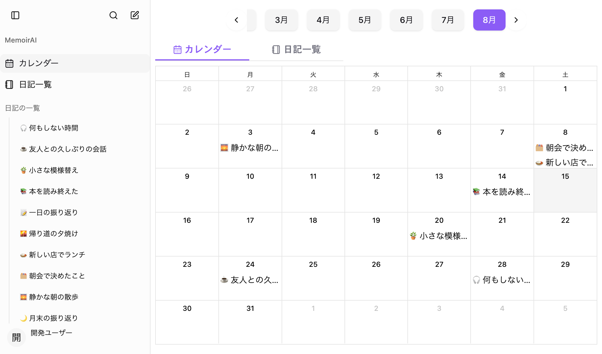

# MemoirAI UI/UX 段階改善プラン

## 概要

MemoirAIの主要画面を、提供されたスクリーンショットと現在の実装を基にレビューした。

基本品質は良好である。紫のアクセント、カード、Dialog、余白には一貫性があり、削除確認や下書き保護も丁寧に設計されている。一方、日記作成時の入力意図、カレンダーから日記へ移動するときの視線誘導、検索・設定Dialogの余白、タグの文字コントラストには改善余地がある。

本計画では現在のシンプルな見た目と紫アクセントを維持し、次の順序で段階的に改善する。

1. 日記を書く
2. 過去の日記を見つける
3. 設定を理解して変更する

## 画面レビュー

### 1. ナビゲーション／カレンダー — 概ね良好、視線誘導は要改善

サイドバーは主要ナビゲーション、日記一覧、アカウント領域が整理されている。一方、月選択には年の表示がなく、カレンダー／日記一覧タブがコンテンツ幅の左側だけを占めるため、月選択、表示切替、カレンダーの関係が弱く見える。曜日と日付の文字も小さめである。

### 2. 日記詳細／操作メニュー — 良好

日付、タイトル、本文、タグの階層は明快である。編集、共有、削除も一つのメニューにまとまり、削除は確認Dialogを介するため安全性が高い。画像比率とカルーセルの現仕様は維持する。

.png>)

### 3. 新規日記作成／下書き — 要改善、最優先

本文入力欄が大きい一方、画像追加はアイコンだけ、タグの追加方法には説明がなく、「セクション」が保存後に個別の日記になることも伝わりにくい。自動下書き保存は実装済みだが、その状態が画面に表示されていない。複数の出来事を追加してスクロールすると、保存操作も画面外へ移動する。

.png>)

### 4. 検索 — 要改善

検索構造は単純で分かりやすいが、読み込み中や初期状態でも大きな空白が残る。進行状態もテキストだけで、支援技術へ状態変化を通知する構造がない。

.png>)

### 5. 設定／メモリ — 概ね良好、密度は要改善

プロフィール、一般、メモリのカテゴリー分けと選択状態は明快である。プロフィールなど内容が少ない画面でもDialogの高さが固定されるため、大きな空白が生まれている。メモリの編集・削除操作は分かりやすいが、アイコン操作のタップ領域とフォーカス表示を継続して確認する必要がある。

.png>)

## 良い点

- 紫のアクセント、Card、Dialog、Buttonの表現が画面間で一貫している。
- 日記詳細では日付、タイトル、本文、タグの情報階層が明確である。
- 削除や下書き破棄には確認Dialogがあり、取り返しのつかない操作を防いでいる。
- 作成内容の自動保存、復元、画面離脱時の保護が実装されている。
- サイドバーではヘッダー、ナビゲーション、フッターを固定し、日記一覧だけをスクロールできる。
- 設定ではテーマやプライマリカラーの選択状態を色以外の枠線やチェックでも示している。

## 主なリスク

### 構造上のリスク

- 月別日記の行がクリックイベント付きコンテナであり、リンクとしてのキーボード操作や読み上げが不足している。
- Calendarの日セルと日記イベントがそれぞれボタン相当になり、キーボード操作対象が重複する可能性がある。
- 全要素のfocus outlineを消すグローバル指定があり、コンポーネント固有のfocus-visible指定がない操作では現在位置を見失う可能性がある。
- 新規日記のカードは保存後に個別の日記になるが、「セクション」という表現では結果を予測しにくい。

### 視覚・アクセシビリティ上のリスク

- ライトテーマの淡色タグに白文字を組み合わせており、コード上の概算コントラストは約1.43:1〜3.51:1である。通常文字の目標4.5:1を満たさない。
- カレンダーの曜日と日付は約10〜12pxで、視認性が低い。
- 画像追加、画像削除、メモリ編集・削除など、アイコンのみの操作は画面上で意味を推測しなければならない。
- 検索の読み込み状態は視覚的にも支援技術上も変化が弱い。
- 内容の少ない設定画面や検索状態でも大きなDialogが維持され、情報密度が低く見える。

## 実装計画

### フェーズ1：アクセシビリティとUI基盤

- 淡色タグ専用のforeground tokenを追加し、通常文字で4.5:1以上のコントラストを確保する。
- 複数featureから利用される`DiaryTag`を共有UIへ移し、背景色と文字色を一元管理する。
- 全要素のfocus outlineを消すグローバル指定を廃止し、リンク、ボタン、タブ、カレンダーに統一した`focus-visible`リングを表示する。
- 月別日記のクリック領域を実際のリンクへ変更し、クリックとEnterの両方で日別詳細を開けるようにする。
- Calendarの日セルとイベントで重複するボタン構造を解消し、1日につき一つのキーボード操作対象にする。選択状態は色だけでなく枠線とARIA属性でも示す。
- アイコン操作はモバイルで44px以上を確保し、画像削除を含む全操作へ日本語ラベルを付ける。
- 共通Dialogのスクリーンリーダー向けラベル`Close`を「閉じる」に統一する。

### フェーズ2：日記作成と閲覧導線

- 作成画面上部をsticky action barにし、日付、下書き状態、保存ボタンをスクロール中も表示する。
- 既存の`DraftStatus`を使い、「保存中」「保存済み」「保存できません」を`aria-live`付きで表示する。
- 各カードを「出来事1」「出来事2」と明示し、「セクションを追加」を「別の出来事を追加」に変更する。
- 保存後に各出来事が個別の日記になることを補足する。
- 本文欄の初期高さを約224〜256pxへ抑え、placeholderのコントラストを上げる。
- 画像操作を「画像を追加 0/2」のラベル付きボタンにし、タグ入力には「Enterで追加」の補助文を表示する。
- 月表示に「2026年」のような年ラベルを追加し、カレンダー／日記一覧タブを中央配置・均等幅にする。
- タブ内の`code`要素を通常テキストへ変更する。
- 月別一覧の本文を3行程度にまとめ、全文は日別詳細で読む構成にする。日付はsemanticな`time`として扱う。

### フェーズ3：検索・設定・確認Dialog

- 検索結果領域を固定高から`max-height`へ変更し、初期、空、エラー状態は内容に応じた高さにする。
- 検索読み込み中は2〜3件のSkeletonと`role="status"`を表示し、完了後は結果件数を案内する。
- 設定Dialogはデスクトップでは内容に合わせた高さとし、最大高を超える場合だけ内部スクロールさせる。
- モバイルの縦長構成、カテゴリータブ、nested Dialogの構造は維持する。
- 下書き復元、画面離脱、削除確認で「破棄」の表現とdestructive hierarchyを統一する。
- 既存のモバイルSidebar、固定footer、日記一覧だけをスクロールする構造、Radix Portal境界を維持する。

## インターフェースへの影響

- Route、Firestore schema、Storage、共有URLには変更を加えない。
- 新しい外部依存は追加しない。
- 内部変更は共有`DiaryTag`とtag foreground tokenの追加、既存`DraftStatus`の表示利用を中心とする。
- 画像の3:2／4:5比率、カルーセル、`object-cover`は変更しない。
- viewport上限、日記本文の内部スクロール、Scroll Snapは再導入しない。

## テストと受け入れ条件

### 自動テスト

- 日記作成：本文、タグ、画像、複数の出来事、下書き保存／復元／破棄、保存中状態を確認する。
- 閲覧：月別日記をクリックとEnterの両方で開け、戻り先が保持されることを確認する。
- Calendar：日付選択、選択表示、キーボード操作、日記0件／複数件を確認する。
- 検索：loading、初期案内、0件、複数結果、エラー、Esc終了を確認する。
- 設定：内容が少ない場合の高さ、長いメモリ一覧の内部スクロール、nested edit/delete Dialogを確認する。

### 手動確認

- 375×812、768×1024、1024×804、1440×900で確認する。
- light／darkテーマを確認する。
- キーボードだけで主要操作を完了できることを確認する。
- 200% zoomで横スクロールや操作不能が発生しないことを確認する。
- loading、empty、error、disabled、保存中の各状態を確認する。

### 静的検証

- 対象ファイルへのPrettierとESLint
- 関連Vitest
- `pnpm build`
- `git diff --check`

全体lintに既知のHooks失敗が残る場合は、今回の回帰と分けて報告する。

## 前提と対象外

- 現在のシンプルなデザイン、紫アクセント、shadcn/ui、Radix UI、Tailwind CSSの構成を維持する。
- 全面的な情報設計の変更や新しい画面の追加は行わない。
- 提供画像はライトテーマのデスクトップ幅が中心であるため、モバイル、ダークテーマ、実際のフォーカス移動、読み上げ、motionは実装時に追加検証する。
- 本計画では改善内容を定義し、実装順序はフェーズ1、フェーズ2、フェーズ3とする。

## 監査資料

以下の21枚を、レビュー時点の画面資料として保存する。

1. [カレンダー](../../screen-shots/localhost_3000_new-diary_2026-08-14.png)
2. [日記一覧](<../../screen-shots/localhost_3000_new-diary_2026-08-14 (1).png>)
3. [日別詳細](<../../screen-shots/localhost_3000_new-diary_2026-08-14 (2).png>)
4. [日記操作メニュー](<../../screen-shots/localhost_3000_new-diary_2026-08-14 (3).png>)
5. [日記削除確認](<../../screen-shots/localhost_3000_new-diary_2026-08-14 (4).png>)
6. [日記編集](<../../screen-shots/localhost_3000_new-diary_2026-08-14 (5).png>)
7. [画像付き日記詳細](<../../screen-shots/localhost_3000_new-diary_2026-08-14 (6).png>)
8. [縦長画像付き日記詳細](<../../screen-shots/localhost_3000_new-diary_2026-08-14 (7).png>)
9. [新規日記作成](<../../screen-shots/localhost_3000_new-diary_2026-08-14 (8).png>)
10. [画像を追加した日記作成](<../../screen-shots/localhost_3000_new-diary_2026-08-14 (9).png>)
11. [作成中の日記に関する確認](<../../screen-shots/localhost_3000_new-diary_2026-08-14 (10).png>)
12. [保存された下書きの確認](<../../screen-shots/localhost_3000_new-diary_2026-08-14 (11).png>)
13. [アカウントメニュー](<../../screen-shots/localhost_3000_new-diary_2026-08-14 (12).png>)
14. [プロフィール設定](<../../screen-shots/localhost_3000_new-diary_2026-08-14 (13).png>)
15. [一般設定](<../../screen-shots/localhost_3000_new-diary_2026-08-14 (14).png>)
16. [メモリ設定](<../../screen-shots/localhost_3000_new-diary_2026-08-14 (15).png>)
17. [メモリ編集](<../../screen-shots/localhost_3000_new-diary_2026-08-14 (16).png>)
18. [メモリ削除確認](<../../screen-shots/localhost_3000_new-diary_2026-08-14 (17).png>)
19. [日記検索の読み込み](<../../screen-shots/localhost_3000_new-diary_2026-08-14 (18).png>)
20. [日記検索結果](<../../screen-shots/localhost_3000_new-diary_2026-08-14 (19).png>)
21. [選択日の日記表示](<../../screen-shots/localhost_3000_new-diary_2026-08-14 (20).png>)
